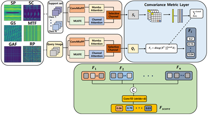
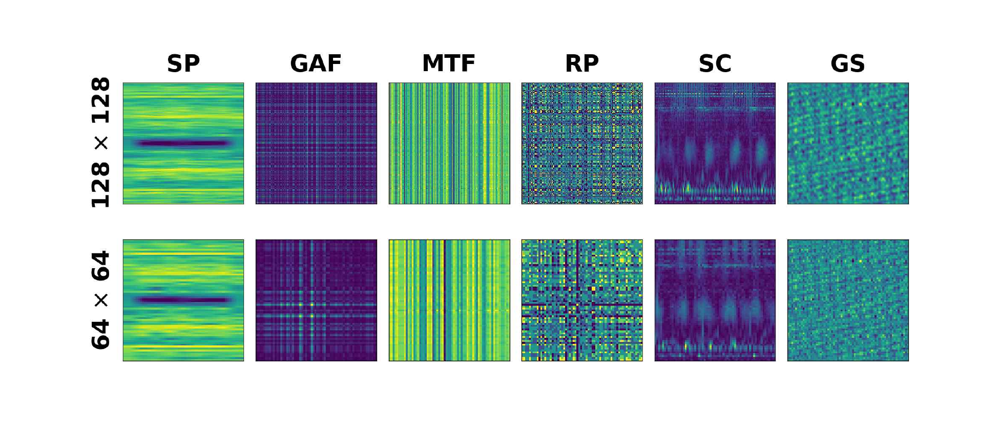

# SC-MambaFew Input Representation Analysis

> Input representation analysis for SC-MambaFew-based few-shot bearing fault diagnosis.

This repository provides the implementation for analyzing how different signal-to-image input representations affect few-shot bearing fault diagnosis performance using an SC-MambaFew-based backbone.

This work does **not** propose a new SC-MambaFew architecture. Instead, it keeps the SC-MambaFew backbone fixed and compares six input representations under clean and noisy CWRU bearing fault diagnosis conditions.

<p align="center">
  
</p>

## Paper Information

- **Title:** Optimal Input Representation Analysis for Few-shot Learning in Mamba-based Industrial Equipment Fault Diagnosis Model
- **Korean Title:** Mamba 기반 설비 고장 진단 모델의 Few-shot 학습을 위한 최적 입력 표현 분석
- **Paper Type:** Conference paper
- **Conference:** ISET 2026
- **Task:** Few-shot bearing fault diagnosis and input representation analysis
- **Backbone Model:** SC-MambaFew
- **Input Representations:** SP, SC, GS, RP, MTF, GAF
- **Dataset:** CWRU Bearing Dataset
- **Keywords:** Few-shot Learning, Bearing Fault Diagnosis, Mamba, SC-MambaFew, Input Representation, CWRU, Time-series-to-image, Industrial Equipment Diagnosis

## Overview

Few-shot bearing fault diagnosis is important in industrial environments where labeled fault data are limited. SC-MambaFew performs few-shot diagnosis by combining Mamba-based spatial modeling, selective spatial-channel attention, and covariance metric learning.

The original SC-MambaFew setting mainly uses a Spectrogram (SP) representation. This repository extends the input stage and compares six signal-to-image representations:

<p align="center">
  
</p>

| Abbreviation | Representation | Description |
|---|---|---|
| SP | Spectrogram | STFT-based time-frequency representation |
| SC | Scalogram | Wavelet-based time-frequency representation |
| GS | Gray-scale Encoding | Direct signal-to-image mapping |
| RP | Recurrence Plot | State recurrence pattern representation |
| MTF | Markov Transition Field | Transition-probability-based representation |
| GAF | Gramian Angular Field | Angular temporal correlation representation |

## Difference from the Official SC-MambaFew Repository

| Item | Official SC-MambaFew | This Repository |
|---|---|---|
| Main objective | Few-shot bearing fault diagnosis model | Input representation analysis using SC-MambaFew |
| Input representation | Mainly Spectrogram | SP, SC, GS, RP, MTF, GAF |
| Resolution setting | Fixed setting | 64×64 and 128×128 |
| Noise setting | Not the main focus | Clean and Gaussian noise 10 dB |
| Dataset setting | CWRU and HUST | CWRU 12DriveEndFault |
| Contribution focus | Model architecture | Effect of input representation on few-shot diagnosis |

## Method

The experimental pipeline is:

```text
Raw vibration signal
→ 2048-point windowing
→ DE/FE signal concatenation
→ signal-to-image representation
→ SC-MambaFew backbone
→ covariance metric layer
→ few-shot classification
```

The backbone consists of:

- ConvMixer-based feature extraction
- Mamba attention block
- Multi-level feature extractor
- Channel attention
- Selective channel fusion
- Covariance metric layer

## Dataset

The experiments use the **Case Western Reserve University Bearing Dataset (CWRU)**.

| Setting | Value |
|---|---|
| Dataset | CWRU Bearing Dataset |
| Subset | 12DriveEndFault |
| RPM | 1772, 1750, 1730 |
| Number of classes | 10 |
| Classes | Normal + 9 fault classes |
| Fault types | Ball, Inner Race, Outer Race |
| Fault sizes | 0.007, 0.014, 0.021 inch |
| Window size | 2048 |
| Flattened input length | 4096 |
| 1-shot training pool | 30 samples |
| 5-shot training pool | 150 samples |
| Test set | 750 samples |

Expected local dataset structure:

```text
CWRU/
├── 12DriveEndFault/
│   ├── 1730/
│   ├── 1750/
│   └── 1772/
└── NormalBaseline/
    ├── 1730/
    ├── 1750/
    └── 1772/
```

The raw CWRU `.mat` files are not included in this repository.

## Experimental Setup

| Item | Setting |
|---|---|
| Backbone | SC-MambaFew |
| Shots | 1-shot, 5-shot |
| Input resolutions | 64×64, 128×128 |
| Epochs | 10 |
| Batch size | 1 |
| Optimizer | Adam |
| Learning rate | 0.001 |
| Evaluation metrics | Accuracy, F1 score |
| Noise condition | Gaussian noise 10 dB |

## Results

### Table 1. Performance under Clean Data Conditions

| Representation | Shot | Accuracy 64×64 (%) | Accuracy 128×128 (%) | F1 64×64 (%) | F1 128×128 (%) |
|---|---:|---:|---:|---:|---:|
| SP | 1 | 98.8 | 99.8 | 98.8 | 99.8 |
| SP | 5 | 99.6 | 99.8 | 99.6 | 99.8 |
| SC | 1 | 86.7 | 86.9 | 86.7 | 86.9 |
| SC | 5 | 96.1 | 96.5 | 96.2 | 96.7 |
| GS | 1 | 52.1 | 84.8 | 52.1 | 86.9 |
| GS | 5 | 88.8 | 96.3 | 89.1 | 96.4 |
| RP | 1 | 32.5 | 45.9 | 32.5 | 45.9 |
| RP | 5 | 38.4 | 60.1 | 38.0 | 60.1 |
| GAF | 1 | 17.9 | 27.4 | 17.9 | 27.4 |
| GAF | 5 | 29.7 | 39.7 | 29.5 | 37.2 |
| MTF | 1 | 17.5 | 24.1 | 17.5 | 24.1 |
| MTF | 5 | 36.3 | 38.3 | 35.1 | 36.6 |

Under clean data conditions, **SP** achieved the highest accuracy and F1 score across both 1-shot and 5-shot settings. This indicates that the STFT-based spectrogram is highly effective when the vibration signal is relatively clean.

### Table 2. Performance under Gaussian Noise 10 dB

| Representation | Shot | Accuracy 64×64 (%) | Accuracy 128×128 (%) | F1 64×64 (%) | F1 128×128 (%) |
|---|---:|---:|---:|---:|---:|
| SC | 1 | 62.2 | 71.6 | 62.2 | 71.6 |
| SC | 5 | 83.8 | 84.6 | 83.1 | 84.6 |
| SP | 1 | 54.5 | 20.5 | 54.5 | 20.6 |
| SP | 5 | 72.0 | 22.1 | 69.7 | 22.1 |
| GS | 1 | 44.7 | 81.0 | 44.7 | 81.0 |
| GS | 5 | 83.1 | 87.3 | 83.1 | 87.3 |

Under Gaussian noise 10 dB, **SC** and **GS** showed stronger robustness than SP. GS at 128×128 achieved the highest 5-shot performance under noise, while SC maintained stable performance across both resolutions.

## Key Observations

- **Clean condition:** SP is the most effective representation.
- **Noise condition:** SC and GS are more robust than SP.
- **Resolution effect:** GS benefits significantly from 128×128 resolution.
- **Representation dependency:** The optimal input representation changes depending on noise level, resolution, and shot setting.

## Installation

```bash
conda create -n mamba_fault python=3.10 -y
conda activate mamba_fault
pip install -r requirements.txt
```

If Mamba dependencies fail to install automatically, install them separately according to your CUDA and PyTorch environment:

```bash
pip install causal-conv1d
pip install mamba-ssm
```

## Training

### 1-shot Example

```bash
python train.py \
  --dataset CWRU \
  --shot_num 1 \
  --transform SP \
  --resolution 64 \
  --num_epochs 10 \
  --training_samples_CWRU 30 \
  --data_path CWRU \
  --path_weights checkpoints
```

### 5-shot Example

```bash
python train.py \
  --dataset CWRU \
  --shot_num 5 \
  --transform SC \
  --resolution 128 \
  --num_epochs 10 \
  --training_samples_CWRU 150 \
  --data_path CWRU \
  --path_weights checkpoints
```

Shell script examples:

```bash
bash scripts/train.sh 1 SP 64 10
bash scripts/train.sh 5 SC 128 10
```

## Evaluation

### Clean Evaluation

```bash
python test.py \
  --dataset CWRU \
  --shot_num 1 \
  --transform SP \
  --resolution 64 \
  --training_samples_CWRU 30 \
  --data_path CWRU \
  --best_weight checkpoints/cwru_1shot_64_SP/best.pth
```

### Gaussian Noise 10 dB Evaluation

```bash
python test.py \
  --dataset CWRU \
  --shot_num 1 \
  --transform SP \
  --resolution 64 \
  --training_samples_CWRU 30 \
  --data_path CWRU \
  --best_weight checkpoints/cwru_1shot_64_SP/best.pth \
  --noise_DB 10
```

Shell script examples:

```bash
bash scripts/test.sh 1 SP 64 checkpoints/cwru_1shot_64_SP/best.pth
bash scripts/test.sh 1 SP 64 checkpoints/cwru_1shot_64_SP/best.pth 10
```

## Reproducing Experiments

Run all clean training experiments:

```bash
bash scripts/run_all_clean.sh
```

Run Gaussian noise 10 dB evaluation:

```bash
bash scripts/run_all_noise10_eval.sh
```

Experimental grid:

```text
Shots:       1, 5
Transforms:  SP, SC, GS, RP, MTF, GAF
Resolutions: 64, 128
Conditions:  Clean, Gaussian noise 10 dB
```

## Repository Structure

```text
sc-mambafew-input-representation-analysis/
├── dataloader/
│   └── dataloader.py
├── function/
│   └── function.py
├── net/
│   ├── feature_extractor.py
│   ├── glca.py
│   ├── mamba.py
│   └── new_proposed.py
├── scripts/
│   ├── train.sh
│   ├── test.sh
│   ├── run_all_clean.sh
│   └── run_all_noise10_eval.sh
├── tools/
│   ├── visualize_transforms.py
│   └── plot_curves.py
├── assets/
│   ├── figure1_method_overview.png
│   └── figure2_input_representations.png
├── train.py
├── test.py
├── requirements.txt
├── metadata.txt
└── README.md
```

## Citation

If you use this repository, please cite:

```bibtex
@inproceedings{min2026inputrepresentation,
  title={Optimal Input Representation Analysis for Few-shot Learning in Mamba-based Industrial Equipment Fault Diagnosis Model},
  author={Jae Yeong Min and Sang Jun Park and Jun-Seok Yun and Yejin Kim and Min Su Kim and Jong Pil Yun},
  booktitle={ISET 2026},
  year={2026}
}
```

Please also cite the original SC-MambaFew paper:

```bibtex
@article{truong2025scmambafew,
  title={SC-MambaFew: Few-shot learning based on Mamba and selective spatial-channel attention for bearing fault diagnosis},
  author={Truong, Gia-Bao and Tran, Thi-Thao and Than, Nhu-Linh and Nguyen, Van Quang and Nguyen, Thi Hue and Pham, Van-Truong},
  journal={Computers and Electrical Engineering},
  volume={121},
  pages={110004},
  year={2025}
}
```

## Acknowledgements

This repository is built upon the SC-MambaFew framework and is intended for input representation analysis in few-shot bearing fault diagnosis.

The CWRU Bearing Dataset is provided by the Case Western Reserve University Bearing Data Center.

## License

This repository is released for academic and research purposes. Please check the license terms of the original SC-MambaFew implementation and the CWRU Bearing Dataset before redistribution or commercial use.
